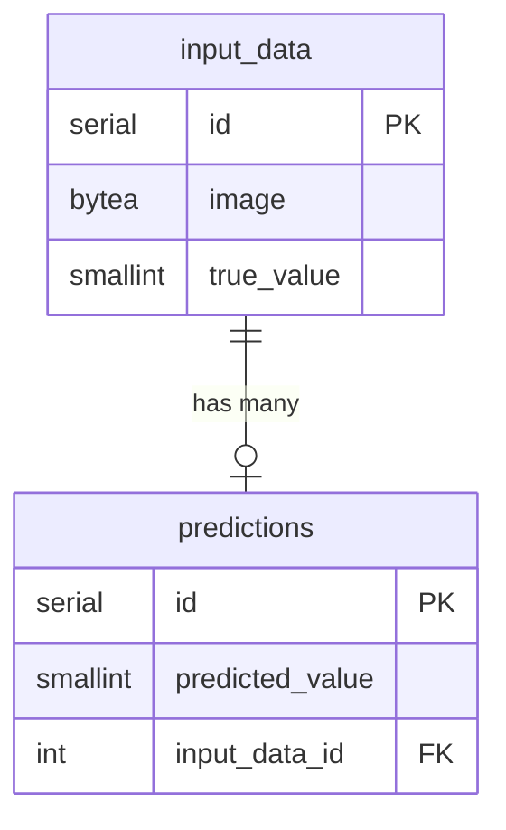

# Report "Data Science Toolkits and Architectures"
#### Jan Murer, Frederik Poschenrieder, Jessica Ugowe 


# Milestone_3

## Task 1 - Understanding Docker Compose

**Which services are being used for the application (described in the link above)? How do they relate to the host names in terms of computer networks?**

There are two services used. One called "web", which is the web app created in flask and one called "redis", that is a redis image from the docker hub.

**What ports are being used (within the application and in the docker-compose file)?**

The "web" service, internally listens to port 5000 in the container, while it is exposed externally the port 8000. For the "redis" service, the default port 6379 is used both internally and externally. 
Within the application, the "redis" service is then accessed via the 6379 port. 

**How does the host machine (e.g. your computer) communicate with the application inside the Docker container. Which ports are exposed from the application to the host machine?**

The host machine communicates with the Flask application in the web service via the exposed port 8000. When you access localhost on port 8000, the request is forwarded to port 5000 inside the web container, where the Flask application is running.

The Redis service does not have additional port mappings for the host machine in this configuration but is accessible to the web container via the Docker network on port 6379.

**What is localhost, why is it useful in the domain of web applications?**

localhost is your own computer used as the server, where the application is running. This allows you to develop applications locally, where you can easily test and develop withount needing an external server for your app to run on.


## Task 2 - First Steps with PostgreSQL

For this task a docker-compose file was already created, to create a postgre database and a pgadmin interface to inspect the data. 

We made the design choice to create a dockerfile for the creation of the database.
That way we could easily keep the scripts of this task eventhough they are no longer needed after this task.

The application creates a docker container with the database, executes a script that creates a table inside that database, inserts one joke into that database and then returns that joke.

At the time of creation the application would have been started be by executing 'docker compose up'. Since this would cause clutter, they have been commented out of the docker compose file. To rebuild the application, remove the comments from the docker compose file and rebuild the containers. Then the database can be viewed using PgAdmin on localhost port 5050. 

### If you stopped and deleted the Docker container running the database and restarted it. Would your joke still be in the database? Why or why not?

Since there is a volume mounted to the postgre container, where the data is stored, it would still be there. This is exactly the purpose of the docker volume.

## Task 3: Visualizing Samples from the Database

### Key Questions Answered

#### How do you need to represent/transform image data to save it to a relational database?

There are various ways to **represent or transform image data** for storage in a relational database. The method you choose depends on factors such as **performance requirements**, **ease of maintenance**, **database capabilities**, and how frequently you need to retrieve or modify the image data.

1. **Storing Images as Binary Large Objects (BLOBs)**  
   A BLOB is a single database unit made up of binary data. It is commonly used to store multimedia objects such as videos, sounds, and image files [1]. It involves creating a table with a BLOB column (e.g., `BYTEA` in PostgreSQL), reading the image file as a byte array in the application code, and inserting or updating the row with the byte array.

   - **Pros**:  
     - Simplifies backup, restore, and ensures transactional consistency.  
   - **Cons**:  
     - Large images can bloat the database, potentially impacting performance.  
     - Backup and restore times increase as database size grows.

2. **Storing Images as Base64-Encoded Strings**  
   This method involves converting the image file’s bytes into a **Base64-encoded string** in the application code. The Base64 string is then stored in a `VARCHAR` or `TEXT` column. When retrieving, it is decoded back into binary form.

   - **Pros**:  
     - Compatible with systems that expect textual data.  
     - Simplifies certain serialization or JSON-based APIs.  
   - **Cons**:  
     - Increases storage size due to Base64 encoding overhead.  
     - Slower to decode back into binary for image processing.

3. **Storing Images Externally and Saving References**  
   Store the image files on a **file system**, **CDN**, or **object storage service** (e.g., Amazon S3, Google Cloud Storage, Azure Blob Storage), and save only the **reference** (URL or file path) in the database. The application retrieves the images via these references.

   - **Pros**:  
     - Keeps the database lean by storing only references.  
     - Improves performance and scalability.  
   - **Cons**:  
     - Requires managing file systems or external storage.  
     - Ensures consistency between database references and external files.

4. **Storing Derived Metadata and Thumbnails in the Database**  
   Store only **metadata** (e.g., dimensions, format, EXIF data) and small **thumbnail images** in the database, while the full-resolution image is stored externally.

   - **Pros**:  
     - Allows quick access to metadata and previews directly from queries.  
     - Reduces database storage requirements.  
   - **Cons**:  
     - Full-size image retrieval depends on external storage.

---

#### How is your data structured?

The MNIST dataset consists of 28x28 pixel grayscale images of handwritten digits (0–9). Each image is represented as a 2D NumPy array of shape `(28, 28)` with 8-bit unsigned integer values (0–255).

When loaded using Keras:  
```python
(x_train, y_train), (x_test, y_test) = keras.datasets.mnist.load_data()

```
We get:

- **(x_train, y_train)**: 60,000 training images and their labels.  
- **(x_test, y_test)**: 10,000 test images and their labels.  

Where:

- **x_train and x_test** are **NumPy arrays** of shape `(60000, 28, 28)`.  
- **y_train and y_test** are **one-dimensional arrays** containing integer labels for each corresponding image.

---

#### Explain how you would define your relational database tables in terms of their attributes to save your data. What kind of data types could you use?

To store the MNIST images and labels in a relational database (e.g., PostgreSQL), we need to first consider how to represent the image and its metadata (label, possibly dimensions).

A straightforward schema might include the following attributes:

- **id**:  
   - Data Type: `SERIAL` (Primary Key)  
   - Description: Provides a unique identifier for each stored image.

- **image**:  
   - Data Type: `BYTEA`  
   - Description: Stores binary data to preserve the exact byte structure of the image.

- **true_value**:  
   - Data Type: `SMALLINT`  
   - Description: Stores the integer labels (0–9) corresponding to the MNIST dataset.
---

#### What additional relational database table attributes might make sense to easily query your data (f.e. find all pictures of giraffes)?

In situations such as finding all pictures of giraffes, there are multiple ways to store and query label information:

1. **Text-Based Attribute**:  
   Use a text-based column `label_name` directly in the table to describe the image (e.g., "giraffe").  
   - This approach is simple but may lead to redundancy and inefficiency for large datasets.

2. **Separate Table for Labels**:  
   Create a separate table for labels, especially when we need to map numeric labels to descriptive names.  
   - Example:  
     - A `labels` table containing `label_id` and `label_name`.  
     - Reference the `label_id` from the `mnist_data` table.

   This structure allows for efficient joins and avoids duplication of descriptive names.

3. **Handling Multiple Descriptors Per Image**:  
   Use a **junction table** to manage many-to-many relationships:  
   - Example: Separate `tag` tables and a `junction` table to support multiple tags like "giraffe", "savannah", or "wildlife" for a single image.

---

**Steps taken to repeat Task 2**

-   Python Script(ms3_mnist_task3) Functionality:
    -   Created a new Dockerfile, taht is accessed via the docker compose.
    -   Create a new database, ms3_mnist.
    -   Create a table, mnist_data
    -   Load the MNIST dataset using Keras.
    -   Insert the 100 MNIST samples into the mnist_data table.
    -   Fetch some of the inserted samples and display their value.

 **Note task 4 was build on top of this, but it will still display values of some samples when you execute docker compose up**

---

## Task 4: Multi-Docker Container Application

**Steps Taken**

-  Created a Docker Compose file that starts both the dabase application and the model creation from the previous milestones
-  PostgreSQL container initializes the database
-  Main app (model creation):

    - starts immediatly
    - loads the MNIST data from the web
    - trains a neural network
    - 
-  database app (newly created):

    -   Waits for database to be ready
    -   Waits for the model to be trained in the other app and starts after it is stored in the shared volume
    -   Creates tables using psycopg2
    -   Loads MNIST data
    -   Makes predictions
    -   returns a sampe prediction 
    -   Stores results in database
- PgAdmin container:

    - automatically connects to the database and establishes a connection via a json with the credetials
    - can be accessed via the localhost port 5050 (password: "postgre" must be entered)
    

-   Ran 
    ```bash
    docker-compose up 
    ```
---

### Key Questions Answered

**How did you choose to structure your database?**

Schema Explanation: There are two tables namely;

`input_data` Table: This table stores the MNIST image data and it consists of the following attributes:

-   id: Primary key, auto-incrementing integer
-   data: Binary (bytea) field to store the serialized MNIST image
        One-to-many relationship with PREDICTIONS
-   true_value: Smallint field storing the true value of the image

`predictions` Table: This table stores the predictions made by the neural network and it consists of the following attributes:

-   id: Primary key, auto-incrementing integer
-   input_id: Foreign key referencing INPUT_DATA(id)
-   prediction: Float value storing the model's prediction (0-9 for MNIST)

Key Design Decisions:

-   Used separate tables to maintain a clean separation between input data and predictions
-   Implemented a one-to-many relationship allowing multiple predictions for the same input if needed
-   Chose bytea type for image data to efficiently store serialized numpy arrays
-   Used foreign key constraint to maintain referential integrity between tables

This schema allows us to:

-   Store and retrieve MNIST images
-   Link predictions to their corresponding input data 
-   Maintain data integrity through proper relationships
-   Query related data efficiently



---

**Docker has a condition attribute, explain what all the 3 possible condition attributes do**

-   service_started: This condition is the default condition used by Compose and only checks whether the service's container has started, without verifying the service's internal state or health[2].

-   service_healthy: This condition is used to ensure not only that the service's container has started but also that the service inside the container has successfully passed a health check. It ensures that the service is fully operational and ready to accept requests[2].This specifies that a dependency is expected to be “healthy”, which is defined with healthcheck, before starting a dependent service[3].

-   service_completed_successfully: This condition is used to ensure that the service's container not only starts and runs, but also completes its execution successfully. It's useful in scenarios where the dependent service is a one-time job or task, such as a data migration script, and you want to make sure it finishes without errors before starting another service. To use service_completed_successfully, It is good to ensure that the dependent service exits with a zero status code upon successful completion[2]. 

---

**How could you use service_healthy to make sure that the DB is running before the python script tries to connect to it?**

In our `docker-compose.yml`, we used the `healthcheck` and `depends_on` with `condition: service_healthy` to ensure database readiness. First, we defined the health check for PostgreSQL

```yaml
    postgres:
    #... other postgres config ...
    healthcheck:
        test: ["CMD-SHELL", "pg_isready -U postgres"]
        interval: 5s
        timeout: 5s
        retries: 5
```
This checks if PostgreSQL is ready to accept connections every 5 seconds.

Then, we made the Python app wait for a healthy status:

```yaml
    python_app:
    #... other python config ...
        depends_on:
            postgres:
                condition: service_healthy
```
This means Docker starts the postgres container, runs the health check command every 5 seconds and if the check fails 5 times, Docker marks the container as unhealthy. Only when PostgreSQL reports as healthy will Docker start the python_app container.

---

## Challenges

1. Database Authentication Error

    Problem: The script(ms3_mnist.py) failed to connect to the PostgreSQL database due to incorrect password or authentication errors.

    Solution: Double-checked the database password in the .env file and ensured the DB_HOST was set correctly to localhost.

2. PgAdmin required to manually enter the Server connection

    Problem: The connection to the Posgre database had to be entered manually in the PgAdmin web-interface

    Solution: we included a json file with the login details. Now only the Password ("postgre") must be entered in the web interface.

4. Application crashed because model was not available

    Problem: We stored the model in a volume that is mounted to the app and the db_app. However, the model must first be created. Since the model training takes quite long the db_app wants to access it before it is created and the app creashed.

    Solution: We implemented an .sh file, that is executed in the dockerfile of the db_app. This .sh file has the purpose of keeping the db_app from executing, until the model is loaded into the volume and then starts the db_app.

5. Understanding Docker and Docker Compose

    Problem: Initial difficulty in understanding Docker Compose, volumes, and how containers interact.

    Solution: Gradually built the understanding by running individual Docker commands (docker run) and later transitioning to docker-compose.

6. Handling Errors Gracefully

    Problem: Various errors (e.g., connection failures, missing environment variables) needed to be handled effectively.

    Solution: Added print statements to provide clear feedback when things went wrong.

7. Problems with the folder structure 

    Problem: Python volumes seemed not to exist or where not accessible

    Solution: Carefully tracking the folder structures and where the volumes are exactly placed is especially important in a multi-docker environment.

---

## References
1. [GeeksforGeeks on Blob](https://www.geeksforgeeks.org/blob-full-form/)
2. [Warp Docker-Compose Attributes](https://www.warp.dev/terminus/docker-compose-depends-on)
3. [Docker Documentation](https://docs.docker.com/compose/how-tos/startup-order/)
