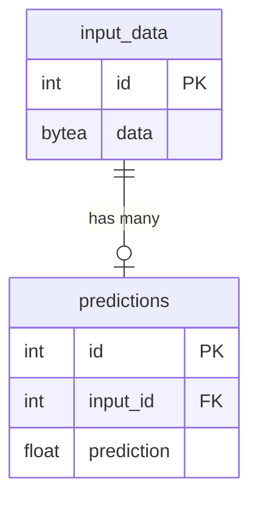

# Report "Data Science Toolkits and Architectures"
#### Jan Murer, Frederik Poschenrieder, Jessica Ugowe 


# Milestone_3

## Task 1: 

---

## Task 2:

---

## Task 3: Visualizing Samples from the Database

### Key Questions Answered

#### How do you need to represent/transform image data to save it to a relational database?

There are various ways to **represent or transform image data** for storage in a relational database. The method you choose depends on factors such as **performance requirements**, **ease of maintenance**, **database capabilities**, and how frequently you need to retrieve or modify the image data.

1. **Storing Images as Binary Large Objects (BLOBs)**  
   A BLOB is a single database unit made up of binary data. It is commonly used to store multimedia objects such as videos, sounds, and image files [1]. It involves creating a table with a BLOB column (e.g., `BYTEA` in PostgreSQL), reading the image file as a byte array in the application code, and inserting or updating the row with the byte array.

   - **Pros**:  
     - Simplifies backup, restore, and ensures transactional consistency.  
   - **Cons**:  
     - Large images can bloat the database, potentially impacting performance.  
     - Backup and restore times increase as database size grows.

2. **Storing Images as Base64-Encoded Strings**  
   This method involves converting the image file’s bytes into a **Base64-encoded string** in the application code. The Base64 string is then stored in a `VARCHAR` or `TEXT` column. When retrieving, it is decoded back into binary form.

   - **Pros**:  
     - Compatible with systems that expect textual data.  
     - Simplifies certain serialization or JSON-based APIs.  
   - **Cons**:  
     - Increases storage size due to Base64 encoding overhead.  
     - Slower to decode back into binary for image processing.

3. **Storing Images Externally and Saving References**  
   Store the image files on a **file system**, **CDN**, or **object storage service** (e.g., Amazon S3, Google Cloud Storage, Azure Blob Storage), and save only the **reference** (URL or file path) in the database. The application retrieves the images via these references.

   - **Pros**:  
     - Keeps the database lean by storing only references.  
     - Improves performance and scalability.  
   - **Cons**:  
     - Requires managing file systems or external storage.  
     - Ensures consistency between database references and external files.

4. **Storing Derived Metadata and Thumbnails in the Database**  
   Store only **metadata** (e.g., dimensions, format, EXIF data) and small **thumbnail images** in the database, while the full-resolution image is stored externally.

   - **Pros**:  
     - Allows quick access to metadata and previews directly from queries.  
     - Reduces database storage requirements.  
   - **Cons**:  
     - Full-size image retrieval depends on external storage.

---

#### How is your data structured?

The MNIST dataset consists of 28x28 pixel grayscale images of handwritten digits (0–9). Each image is represented as a 2D NumPy array of shape `(28, 28)` with 8-bit unsigned integer values (0–255).

When loaded using Keras:  
```python
(x_train, y_train), (x_test, y_test) = keras.datasets.mnist.load_data()

```
We get:

- **(x_train, y_train)**: 60,000 training images and their labels.  
- **(x_test, y_test)**: 10,000 test images and their labels.  

Where:

- **x_train and x_test** are **NumPy arrays** of shape `(60000, 28, 28)`.  
- **y_train and y_test** are **one-dimensional arrays** containing integer labels for each corresponding image.

---

#### Explain how you would define your relational database tables in terms of their attributes to save your data. What kind of data types could you use?

To store the MNIST images and labels in a relational database (e.g., PostgreSQL), we need to first consider how to represent the image and its metadata (label, possibly dimensions).

A straightforward schema might include the following attributes:

- **id**:  
   - Data Type: `SERIAL` (Primary Key)  
   - Description: Provides a unique identifier for each stored image.

- **label_id**:  
   - Data Type: `INT`  
   - Description: Stores the integer labels (0–9) corresponding to the MNIST dataset.

- **image_data**:  
   - Data Type: `BYTEA`  
   - Description: Stores binary data to preserve the exact byte structure of the image.

- **width**, **height**, and **channel**:  
   - Data Type: `INT`  
   - Description: Optional attributes to represent image dimensions and channel (e.g., grayscale or RGB).

---

#### What additional relational database table attributes might make sense to easily query your data (f.e. find all pictures of giraffes)?

In situations such as finding all pictures of giraffes, there are multiple ways to store and query label information:

1. **Text-Based Attribute**:  
   Use a text-based column `label_name` directly in the table to describe the image (e.g., "giraffe").  
   - This approach is simple but may lead to redundancy and inefficiency for large datasets.

2. **Separate Table for Labels**:  
   Create a separate table for labels, especially when we need to map numeric labels to descriptive names.  
   - Example:  
     - A `labels` table containing `label_id` and `label_name`.  
     - Reference the `label_id` from the `mnist_data` table.

   This structure allows for efficient joins and avoids duplication of descriptive names.

3. **Handling Multiple Descriptors Per Image**:  
   Use a **junction table** to manage many-to-many relationships:  
   - Example: Separate `tag` tables and a `junction` table to support multiple tags like "giraffe", "savannah", or "wildlife" for a single image.

---

**Steps taken to repeat Task 2**

-   Python Script(ms3_mnist_task3) Functionality:
    -   Connect to the PostgreSQL database using credentials from the .env file.
    -   Create a new database, ms3_mnist.
    -   Create a table, mnist_data
    -   Load the MNIST dataset using Keras.
    -   Insert the first 1,000 MNIST samples into the mnist_data table.
    -   Fetch some of the inserted samples and display them using Matplotlib.

-   Started the PostgreSQL Container using 
    ```bash
    docker run --name ms3-postgres -e POSTGRES_PASSWORD=your_password -p 5437:5432 postgres
    ```
-   Ran the Python Script
    ```bash
    python ms3_mnist_task3.py
    ```

---

## Task 4: Multi-Docker Container Application

**Steps Taken**
-  Trained and saved the model using train_model.py in the src/
-  Created a Docker Compose file that starts both containers
-  PostgreSQL container initializes the database
-  Python container:

    -   Waits for database to be ready
    -   Creates tables using SQLAlchemy
    -   Loads MNIST data
    -   Makes predictions
    -   Stores results in database

-   Ran 
    ```bash
    docker-compose up --build` to start both services.
    ```
---

### Key Questions Answered

**How did you choose to structure your database?**

Schema Explanation: There are two tables namely;

`input_data` Table: This table stores the MNIST image data and it consists of the following attributes:

-   id: Primary key, auto-incrementing integer
-   data: Binary (bytea) field to store the serialized MNIST image
        One-to-many relationship with PREDICTIONS

`predictions` Table: This table stores the predictions made by the neural network and it consists of the following attributes:

-   id: Primary key, auto-incrementing integer
-   input_id: Foreign key referencing INPUT_DATA(id)
-   prediction: Float value storing the model's prediction (0-9 for MNIST)

Key Design Decisions:

-   Used separate tables to maintain a clean separation between input data and predictions
-   Implemented a one-to-many relationship allowing multiple predictions for the same input if needed
-   Chose bytea type for image data to efficiently store serialized numpy arrays
-   Used foreign key constraint to maintain referential integrity between tables

This schema allows us to:

-   Store and retrieve MNIST images
-   Link predictions to their corresponding input data 
-   Maintain data integrity through proper relationships
-   Query related data efficiently


```mermaid
erDiagram
    input_data {
        int id PK
        bytea data
    }
    predictions {
        int id PK
        int input_id FK
        float prediction
    }
    input_data ||--o| predictions : "has many"

```
---

**Docker has a condition attribute, explain what all the 3 possible condition attributes do**

-   service_started: This condition is the default condition used by Compose and only checks whether the service's container has started, without verifying the service's internal state or health[2].

-   service_healthy: This condition is used to ensure not only that the service's container has started but also that the service inside the container has successfully passed a health check. It ensures that the service is fully operational and ready to accept requests[2].This specifies that a dependency is expected to be “healthy”, which is defined with healthcheck, before starting a dependent service[3].

-   service_completed_successfully: This condition is used to ensure that the service's container not only starts and runs, but also completes its execution successfully. It's useful in scenarios where the dependent service is a one-time job or task, such as a data migration script, and you want to make sure it finishes without errors before starting another service. To use service_completed_successfully, It is good to ensure that the dependent service exits with a zero status code upon successful completion[2]. 

---

**How could you use service_healthy to make sure that the DB is running before the python script tries to connect to it?**

In our `docker-compose.yml`, we used the `healthcheck` and `depends_on` with `condition: service_healthy` to ensure database readiness. First, we defined the health check for PostgreSQL

```yaml
    postgres:
    #... other postgres config ...
    healthcheck:
        test: ["CMD-SHELL", "pg_isready -U postgres"]
        interval: 5s
        timeout: 5s
        retries: 5
```
This checks if PostgreSQL is ready to accept connections every 5 seconds.

Then, we made the Python app wait for a healthy status:

```yaml
    python_app:
    #... other python config ...
        depends_on:
            postgres:
                condition: service_healthy
```
This means Docker starts the postgres container, runs the health check command every 5 seconds and if the check fails 5 times, Docker marks the container as unhealthy. Only when PostgreSQL reports as healthy will Docker start the python_app container.

---

## Challenges

1. Environment File Confusion

    Problem: Confusion about the .env file placement and usage. At one point, the .env file for ms3_mnist was not being detected when running the script.

    Solution: Ensured that ms3_mnist.env was in the root folder and adjusted the load_dotenv path in the script.

2. Database Authentication Error

    Problem: The script(ms3_mnist.py) failed to connect to the PostgreSQL database due to incorrect password or authentication errors.

    Solution: Double-checked the database password in the .env file and ensured the DB_HOST was set correctly to localhost.

3. File Placements

    Problem: Initially, the docker-compose.yml, app.py and 2.Dockerfile file were placed in a folder called python_service, `conn` was used rather than `SQLAlchemy` and a `.env` was also used. This led to several unexplained issues such as being connected to the database but having no tables in the database, path related problems etc..

    Solution: Moved the files out of the python_service folder and started from the beginning using SQLAlchemy and no .env file.

4. PostgreSQL Password Configuration

    Problem: PostgreSQL required a password, but the container logs showed an error because it was not correctly passed.

    Solution: Copied the output and pasted it on Google, viewed stackoverflow answers, read webpages still to no avail. However, we found a solution to the problem on a [Github issue](https://github.com/forem/forem/issues/6563) written by henrynguyen6677, we implemented this and our problem was solved like magic.

5. Understanding Docker and Docker Compose

    Problem: Initial difficulty in understanding Docker Compose, volumes, and how containers interact.

    Solution: Gradually built the understanding by running individual Docker commands (docker run) and later transitioning to docker-compose.

6. Handling Errors Gracefully

    Problem: Various errors (e.g., connection failures, missing environment variables) needed to be handled effectively.

    Solution: Added print statements to provide clear feedback when things went wrong.

---

## References
1. [GeeksforGeeks on Blob](https://www.geeksforgeeks.org/blob-full-form/)
2. [Warp Docker-Compose Attributes](https://www.warp.dev/terminus/docker-compose-depends-on)
3. [Docker Documentation](https://docs.docker.com/compose/how-tos/startup-order/)

