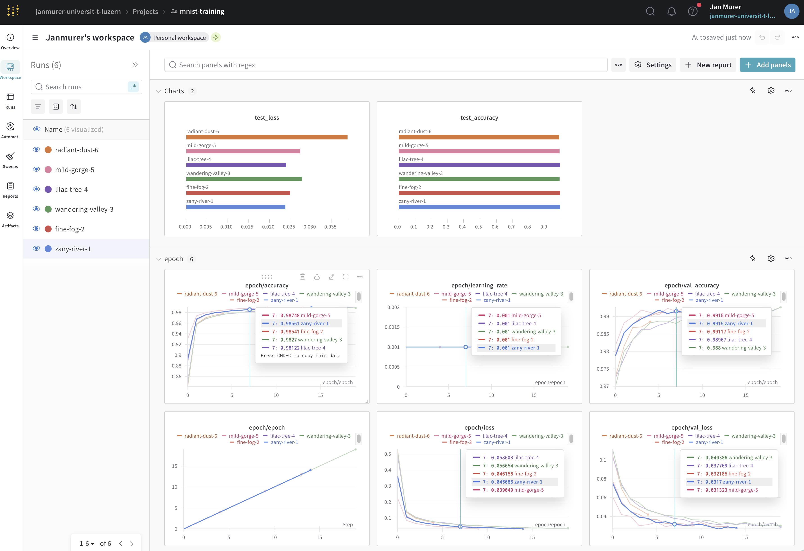

# Report "Data Science Toolkits and Architectures"
#### Jan Murer, Frederik Poschenrieder, Jessica Ugowe 

# Milestone_4

## Task 1: Experiment Management

### Key Questions Answered

**What is Experiment Management and why is it important?**

Experiment management seeks to track progress and experiments systematically. It is used to organize code versions, datasets, hyperparameters, metrics and results. This is mainly to ensure reproducibility, efficiency and collaboration. In easier terms, filenaming such as 'machine_learning_model_xy_v7_final_version2_approved.py' shall be prevented.

In a nutshell tools like WANDB.ai help with:
- Experiment Tracking
    - Logs of all relevant details about the experiments (hyperparameters, metrics, model configurations)
- Visualization of Metrics
- Collaboration and Reproducibility
    - Experiemnt data can be stored on the cloud.
- Model Versioning
    - Management of trained models and datasets
- Scalability

**What is a Metric in ML?**

A metric is a qunatitative measure used to evaluate the performance of a model. Metrics also help to compare different models against each other.

**What is Precision and Recall? Why is there often a trade-off between them?**

- Precision: Ratio of true positive predictions relative to all positive predictions made by the model.

    $\text{Precision} = \frac{\text{True Positives}}{\text{True Positives} + \text{False Positives}}$

- Recall: Ratio of true positive predictions to all actual positive cases.

    $\text{Recall} = \frac{\text{True Positives}}{\text{True Positives} + \text{False Negatives}}$

- Trade-off: Increasing precision often reduces recall and vice versa. By simply classifing everything as Positive one would achieve a Recall of 1, but an essentially useless model. High precesion means fewer false positives and a high recall means fewer false negatives. How the metrics are interpreted ultimately depends on the use case of the model. In medical applications eliminating minimizing false negatives may be more important than false positives, whereas in credit assessment classification minimizing false positives (garanting a credit to a "bad" lender) may be more important.

**What is AUROC (Area under Receiver Operating Characteristic Curve) Metric?**

The AUROC measures a model's abilitiy to distingish between classes. It represents the area under the ROC curve, where the curve plots the true positive rate against the false positive rate. 

**What is a Confusion Matrix?**

A confusion matrix is a summary table used to evaluate the performance of a classification model. It shows the counts of correct and incorrect predictions for each class. 

|                | Predicted Positive | Predicted Negative |
|----------------|--------------------|--------------------|
| **Actual Positive** | True Positive (TP)   | False Negative (FN)  |
| **Actual Negative** | False Positive (FP)  | True Negative (TN)   |

---

## Task 2: 

**Choose an appropriate metric for optimizing your ML Model. What is the reasoning behind it?**

The MNIST dataset is balanced, all classes are equally represented in the data. Therefore, the chosen metric for optimization is Accuracy. Accuracy offers a great interpretability and is a rather straightforward metric. Lastly accuracy is a standard metric in benchmarks for MNIST and allows for seamingless comparison among different models and architectures. 

**Steps taken**

In Task 2, we implemented the following key components:

1. Docker Setup:

-   Created a Dockerfile to containerize our ML training environment
-   Set up a docker_entrypoint.sh script to handle W&B login
-   Used environment variables (.env file) to securely manage the W&B token

2. Machine Learning with W&B Integration:

-   Created main_wandb.py that:

    -   Loads MNIST data
    -   Builds and trains a CNN model
    -   Tracks training metrics using W&B
    -   Uses accuracy as the chosen metric
    -   Saves the trained model

3.  W&B Integration:

    -   Set up logging for:
    -   Model architecture
    -   Training metrics (accuracy, loss)
    -   Model artifacts

4. Run different testruns with different parameters:

    -   Build the docker image using the command `docker build -f wandb/Dockerfile -t wandb_mnist .`.
    -   Change the directory to the root folder of this project.
    -   Run the docker image in interactive mode with the .env variable using the command `docker run -it --env-file .env wandb_mnist /bin/bash`.
    -   Once in interactive mode, install the text editor nano: `apt-get update && apt-get install -y nano`.
    -   Open the corresponding script for hyperparameter tuning using the command: `nano /wandb/main_wandb.py`.
    -   Modify hyperparameter as desired.
    -   Save the changes and exit the file (Ctrl + O, Enter, Ctrl - X).
    -   Run the script using the command: `python /wandb/main_wandb.py`.
    -   Modify hyperparameter as desired.
    -   Log into your wandb.ai account and see how your models compared.

We were not able to make our workspace public, thats why we attached a screenshot of our wandb.ai workspace and our corresponding testruns.

 
## Task 3:

**Steps Taken**

-   Data Loading and Reshaping:
    -   Imported necessary libraries 
    -   Loaded MNIST data using mnist.load_data()
    -   Reshaped data to include channel dimension (60000, 28, 28, 1)

-   Data Analysis through Visualizations:
    -   Displayed a sample digit to see what the data looks like visually
    -   Created an average intensity heatmap showing where digits are typically written
    -   Generated histogram of all pixel values showing the distribution across the dataset
    -   Created a bar chart showing the distribution of digits (0-9)

### The main insight from our analysis is that:

-   MNIST images are mostly binary (black and white)
-   Digits are typically centered in the images
-   The dataset has a specific structure: grayscale images with one channel, sized 28x28 pixels
-   The mean of 33.318 and standard deviation of 78.567 tell us important things about the MNIST dataset:

    -   Mean = 33.318:

        -   This relatively low mean (considering pixel values range from 0-255) indicates that most pixels in the dataset are dark and This makes sense because each image is mostly black background, with only a small portion containing the white digit. If the images were equally black and white, we would expect a mean closer to 127.5 (halfway between 0 and 255)

    -   Standard Deviation = 78.567:

        -   The high standard deviation indicates a strong spread/variation in pixel values.
        -   The large spread confirms the binary nature of MNIST images - pixels tend to be either very dark (0, background) or very bright (255, digit) and rather than having lots of gray values in the middle, we have this big jump from black to white, causing the high standard deviation

Together, these statistics support what we saw in our visualizations - MNIST images consist of mostly black backgrounds (leading to low mean) with stark white digits (causing high standard deviation due to the sharp contrast).

### Challenge

 We believe that making a wandb.ai workplaces public is an option for payed users only. For this reason we are not able to include the link of what we carried out in task 2 (however there is a screenshot of our workplace attached to this report). Also were we not able to download the ground truth of our data to perform further data analysis and comparison between different test runs.

